# French Academy Kids

A web-based French language learning app for children and teens (Grades 1-12). Students progress through four difficulty levels, study vocabulary by topic, and take quizzes to unlock the next level.


## Features

- **Email / password authentication** - sign up, log in, and track progress per account
- **4 structured levels** that unlock sequentially based on quiz pass marks:
  - Level 1 - Débutant (Grades 1-3, 70% pass mark)
  - Level 2 - Élémentaire (Grades 4-6, 70% pass mark)
  - Level 3 - Intermédiaire (Grades 7-9, 75% pass mark)
  - Level 4 - Avancé (Grades 10-12, 80% pass mark)
- **5 quiz card types** - Multiple Choice, Picture Match, Sentence Builder, Translation, Fill-in-the-blank
- **Flashcard study mode** before every quiz
- **Phrase practice** and **sentence builder** activities per level
- **XP points and streak tracking** displayed on the home dashboard
- **Star rating** (0-3 stars) on quiz results
- **Progress reset** - wipe all progress and start over from Level 1


## Screenshots

| Login | Sign Up | Home |
|-------|---------|------|
| 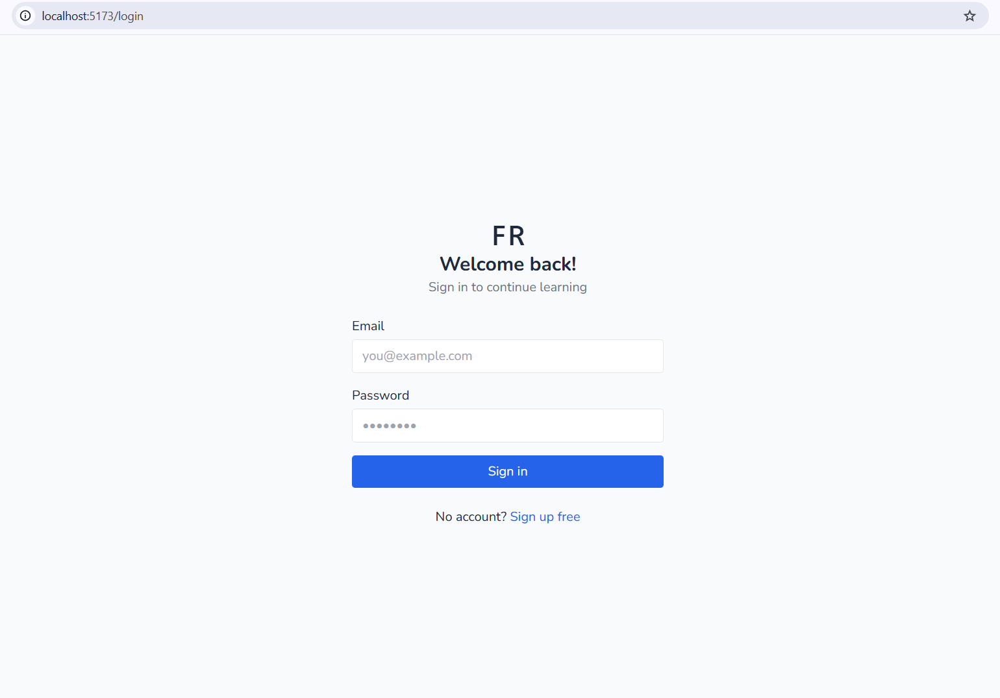 | 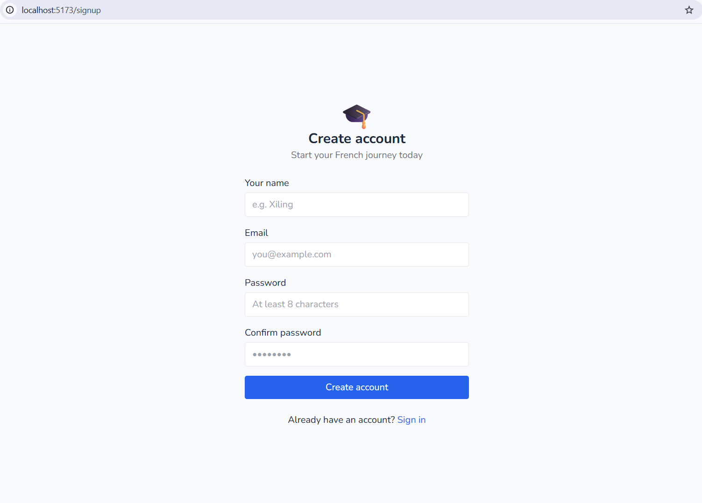 | 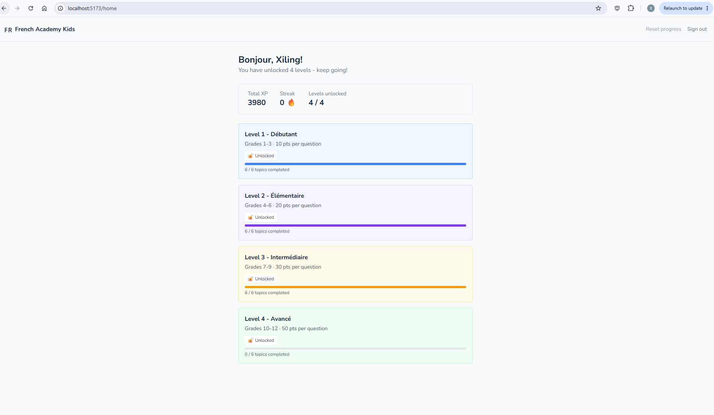 |

| Level 1 Topics | Level 1 Lesson | Level 1 Quiz | Level 1 Results |
|---------------|---------------|-------------|----------------|
| 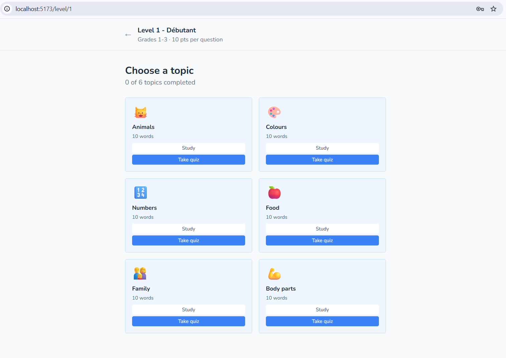 | 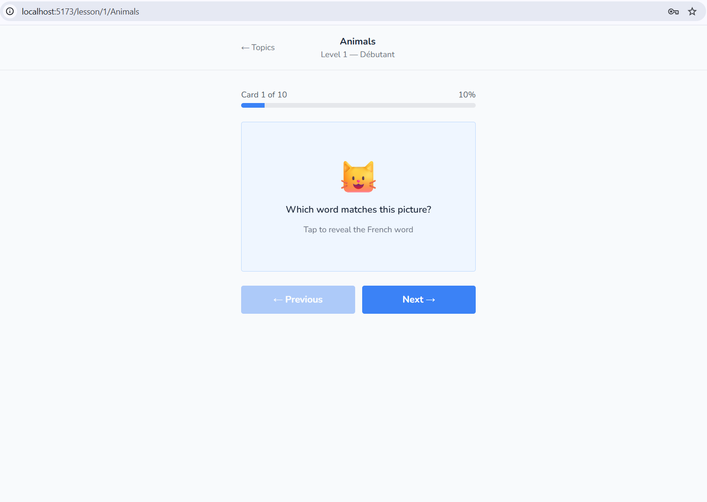 | 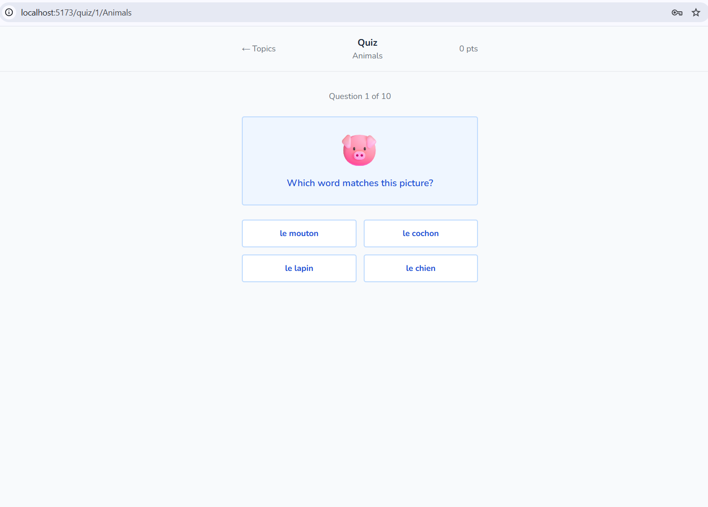 | 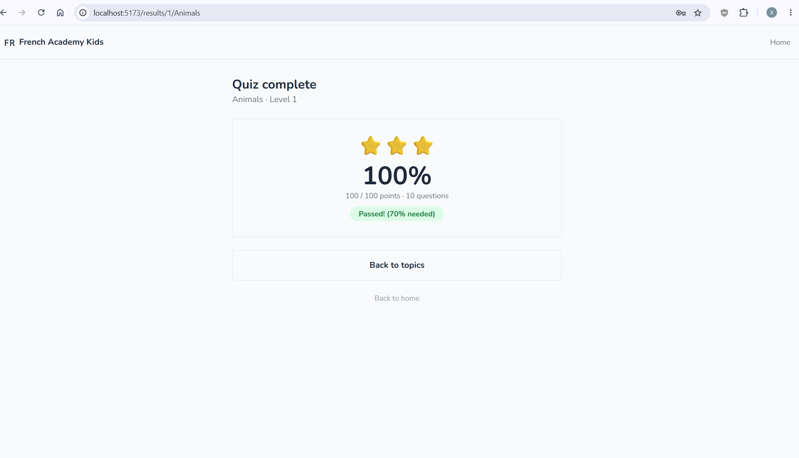 |

| Level 2 Topics | Level 2 Phrases | Level 3 Topics | Level 3 Quiz |
|---------------|----------------|---------------|-------------|
| 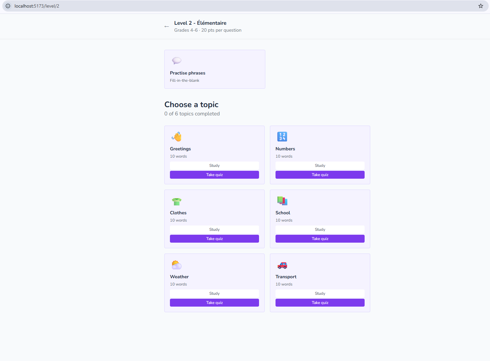 | 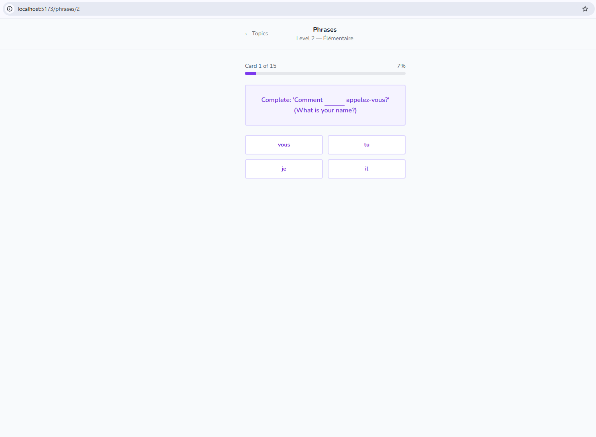 | 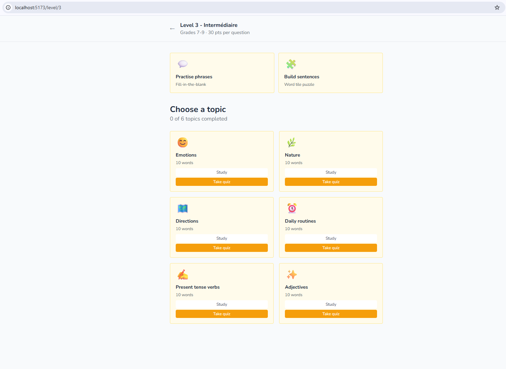 | 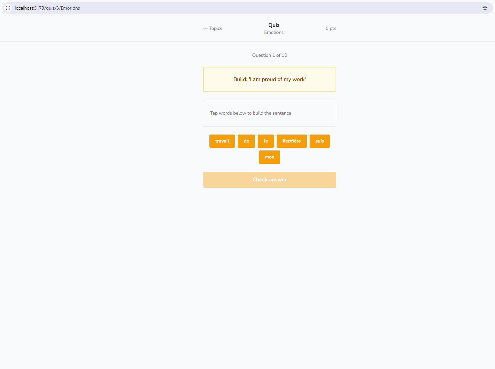 |

| Level 3 Sentence Builder | Level 4 Topics |
|-------------------------|---------------|
| 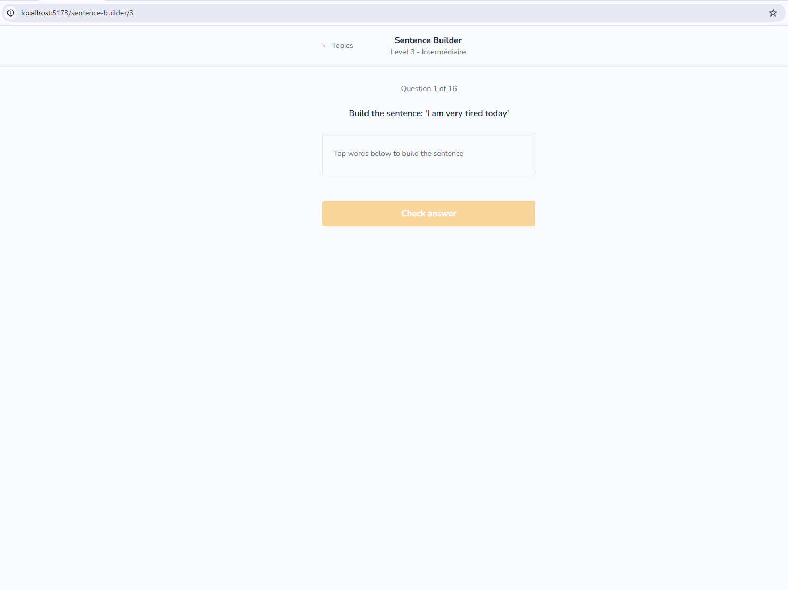 | 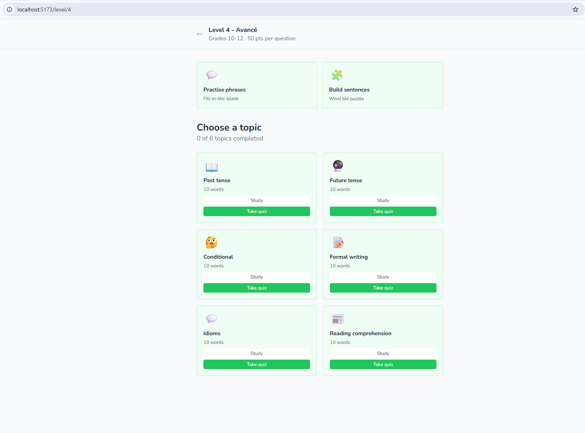 |


## Tech Stack

| Layer | Technology |
|-------|-----------|
| UI framework | React 19 |
| Build tool | Vite 8 |
| Styling | Tailwind CSS 3 |
| Animations | Framer Motion 12 |
| Routing | React Router 7 |
| Auth & Database | Firebase 12 (Auth + Firestore) |


## Getting Started

### Prerequisites

- Node.js 18+
- A Firebase project with **Authentication** (Email/Password) and **Firestore** enabled

### Installation

```bash
# 1. Clone the repo
git clone <your-repo-url>
cd french-academy-kids

# 2. Install dependencies
npm install
```

### Firebase config

Create `src/firebaseConfig.js` with your project credentials:

```js
import { initializeApp } from 'firebase/app'
import { getAuth } from 'firebase/auth'
import { getFirestore } from 'firebase/firestore'

const firebaseConfig = {
  apiKey:            import.meta.env.VITE_FIREBASE_API_KEY,
  authDomain:        import.meta.env.VITE_FIREBASE_AUTH_DOMAIN,
  projectId:         import.meta.env.VITE_FIREBASE_PROJECT_ID,
  storageBucket:     import.meta.env.VITE_FIREBASE_STORAGE_BUCKET,
  messagingSenderId: import.meta.env.VITE_FIREBASE_MESSAGING_SENDER_ID,
  appId:             import.meta.env.VITE_FIREBASE_APP_ID,
}

const app = initializeApp(firebaseConfig)

export const auth = getAuth(app)
export const db   = getFirestore(app)
```

### Run locally

```bash
npm run dev
```

Open [http://localhost:5173](http://localhost:5173) in your browser.

### Other commands

```bash
npm run build    # production build
npm run lint     # run ESLint
```

---

## Firestore data structure

```
users/
  {uid}/
    unlockedLevels: [1]
    totalXP: 0
    currentStreak: 0
    progress/
      {levelId}_{topic}/
        score
        percentage
        bestPercentage
        attempts
        completedAt
```
